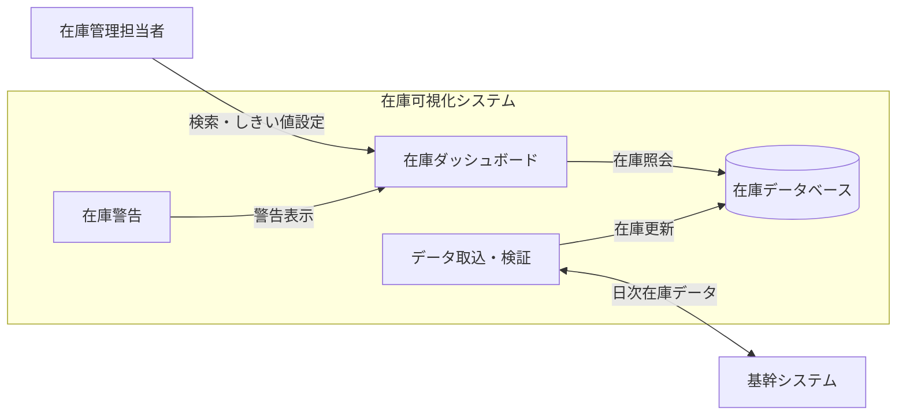

| 項目 | 内容 |
|---|---|
| 提案名 | 在庫可視化システム導入 |
| 提出先 | 架空物流株式会社 |
| 提案元 | サンプルシステム株式会社 |
| 部署・担当者 | DX推進部・山田 太郎 |
| 作成日 | 2026-08-06 |

## 貴社における課題

<!-- source: 架空サンプル入力（実在情報ではない） -->

- 倉庫ごとの在庫情報を複数の表計算ファイルで管理しており、全社在庫の把握に時間差がある。
- 発注判断が担当者の経験に依存し、欠品と過剰在庫が発生している。

## ご要望

<!-- source: 架空サンプル入力（実在情報ではない） -->

- 倉庫別・商品別の在庫を一つの画面で確認したい。
- 在庫が設定値を下回った場合に警告を表示したい。
- 基幹システムの在庫情報を日次で取り込みたい。

## 提案するシステム概要

<!-- source: 架空サンプル入力（実在情報ではない） -->

基幹システムから日次で在庫情報を取り込み、倉庫別・商品別の状況を一元表示するWebシステムを提案する。利用者はダッシュボードで在庫数と警告対象を確認し、発注判断に必要な情報を同じ画面から参照できる。

### 主要機能

- 基幹システムからの在庫データ取込・検証
- 倉庫別・商品別の在庫検索
- 在庫ダッシュボード
- 警告しきい値の設定と表示

## 提案するシステム構成

- 利用者の操作画面と、データ取込・保管処理を提案システム内に集約する。
- 基幹システムから受け取った在庫データを検証後に登録し、ダッシュボードと警告判定で利用する。

## 詳細

<!-- source: 架空サンプル入力（実在情報ではない） -->

### 機能

- 倉庫、商品コード、商品名を条件に在庫を検索する。
- 倉庫別在庫数、全社在庫数、警告状態を一覧表示する。
- 商品単位で警告しきい値を設定する。
- データ取込結果とエラー内容を履歴表示する。

### 外部連携

- 基幹システムが出力するCSVを日次で受信する。
- 受信ファイルの形式、必須項目、文字コードを検証してから登録する。

### データ

- 商品、倉庫、在庫、警告しきい値、取込履歴を管理する。
- 初期データは基幹システムの現行マスターから移行する。

### セキュリティ

- 社内アカウントによる認証を行う。
- 閲覧者と管理者の権限を分け、しきい値変更を管理者に限定する。
- 通信を暗号化し、設定変更とデータ取込の操作履歴を保存する。

### 運用

- 日次取込の成否を監視し、失敗時は運用担当者へ通知する。
- データベースを日次バックアップする。
- 問い合わせ一次対応は顧客側運用担当者が行う。

### 前提条件

- 基幹システムから合意済み形式のCSVを日次出力できる。
- 顧客から商品・倉庫マスターと初期在庫データが提供される。
- 開発は担当者2名、一週5営業日、一部作業を並行して進める。

### 対象外

- 基幹システム側の改修
- 自動発注
- モバイル専用アプリ

## 概算スケジュール

<!-- source: 架空サンプル入力（実在情報ではない） -->

| 工程 | 期間 | 主な作業 | 依存関係 |
|---|---:|---|---|
| 要件定義 | 1週間 | 現行確認、要件確定 | 顧客資料の提供 |
| 設計 | 2週間 | 画面、データ、連携設計 | 要件定義完了 |
| 実装 | 4週間 | 取込、検索、警告、画面実装 | 設計完了 |
| 試験 | 2週間 | 結合試験、受入支援 | 実装完了、試験データ提供 |
| 導入 | 1週間 | 環境設定、初期移行、操作説明 | 試験完了 |

## 概算見積り

<!-- source: [[example-inventory-estimate]] -->

仮単価: `100,000円／人日`

| 工程 | 人日 | Mock金額 |
|---|---:|---:|
| 要件定義 | 5.0 | ¥500,000（税別・Mock） |
| 設計 | 8.0 | ¥800,000（税別・Mock） |
| 実装 | 20.0 | ¥2,000,000（税別・Mock） |
| 試験 | 10.0 | ¥1,000,000（税別・Mock） |
| 導入 | 6.0 | ¥600,000（税別・Mock） |
| **合計** | **49.0** | **¥4,900,000（税別・Mock）** |

### 見積条件

- 記載金額はMockであり、消費税を含まない。
- クラウド利用料、ライセンス費用、旅費は別途とする。
- 要件確定後に再見積りする。

詳細: [[example-inventory-estimate|概算見積明細（架空サンプル）]]

#提案書 #プロジェクト #在庫管理
